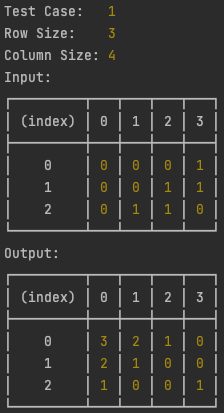

# Bitmap Exercise

### Problem

There is given a rectangular bitmap of size n*m. Each pixel of the bitmap is either white or black, but at least one is white. The pixel in i-th line and j-th column is called the pixel (i,j). The distance between two pixels p1=(i1,j1) and p2=(i2,j2) is defined as d(p1,p2)=|i1-i2|+|j1-j2|. Write a program which:

* reads the description of the bitmap from the standard input;
* for each pixel, computes the distance to the nearest white;
* writes the results to the standard output.
---
#### Input
The number of test cases t (1≤t≤1000) is in the first line of input, then t test cases follow separated by an empty line. In the first line of each test case there is a pair of integer numbers n, m separated by a single space, 1<=n <=182, 1<=m<=182. In each of the following n lines of the test case exactly one zero-one word of length m, the description of one line of the bitmap, is written. On the j-th position in the line (i+1), 1 <= i <= n, 1 <= j <= m, is '1' if, and only if the pixel (i,j) is white.

```
1
3 4
0001
0011
0110
```
---

#### Output
In the i-th line for each test case, 1<=i<=n, there should be written m integers f(i,1),...,f(i,m) separated by single spaces, where f(i,j) is the distance from the pixel (i,j) to the nearest white pixel.
```
3210
2100
1001
```
---
### Description

The application has 3 main layer `config`, `reader` and `calculator`. Config is responsible for parse and validate environment variables from `.env` file
Reader is responsible for read and validate `input` file with given Config parameters
Calculator layer is responsible for calculate the nearest white pixel in the bitmap, uses Breadth First Search algorithm.
After execution final result shows up in the terminal.



### Configuration
Uses `.env` file

| Key               | Default | Description                   |
|-------------------|---------|-------------------------------|
| `BITMAP_MIN_SIZE` | 1       | minimum amount of bitmap size |
| `BITMAP_MAX_SIZE` | 182     | maximum amount of bitmap size |
| `CASE_MIN_SIZE`   | 1       | minimum amount of case        |
| `CASE_MAX_SIZE`   | 1000    | maximum amount of case        |
| `INPUT_FILE_PATH` | ./input | input file location           |

### Setup
install all dependencies via npm

```shell
npm install
```
after installation ready to run program.

```shell
npm run start
```
